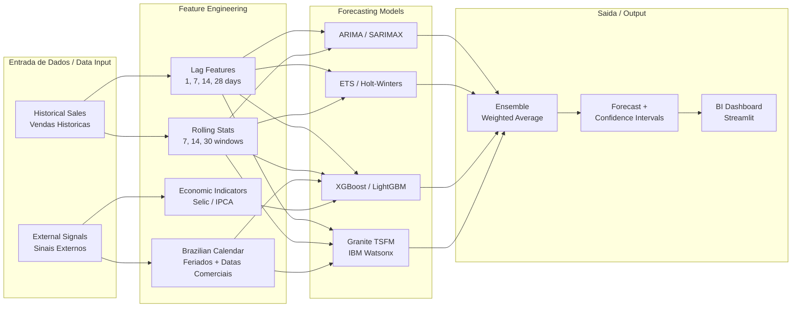
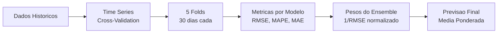

<p align="center">
  <h1 align="center">Watsonx Demand Forecasting BI</h1>
  <p align="center">
    Sistema de previsao de demanda com IBM Watsonx Granite, modelos estatisticos, Machine Learning, calendario brasileiro e dashboards BI
    <br/>
    Demand forecasting system with IBM Watsonx Granite, statistical models, Machine Learning, Brazilian calendar and BI dashboards
  </p>
</p>

<p align="center">
  
  
  
  
  
  
  
</p>

---

## Indice / Table of Contents

- [Arquitetura / Architecture](#arquitetura--architecture)
- [Modelos / Models](#modelos--models)
- [Calendario Brasileiro / Brazilian Calendar](#calendario-brasileiro--brazilian-calendar)
- [Stack Tecnologica / Tech Stack](#stack-tecnologica--tech-stack)
- [Quick Start](#quick-start)
- [Estrutura do Projeto / Project Structure](#estrutura-do-projeto--project-structure)
- [Variaveis de Ambiente / Environment Variables](#variaveis-de-ambiente--environment-variables)
- [Testes / Tests](#testes--tests)
- [Docker](#docker)
- [Autor / Author](#autor--author)
- [Licenca / License](#licenca--license)

---

## Arquitetura / Architecture

**PT-BR:** O sistema ingere dados historicos de vendas e sinais externos (clima, promocoes, indicadores economicos), aplica engenharia de features com lags, estatisticas moveis e calendario brasileiro completo, executa multiplos modelos de previsao em paralelo e combina os resultados via ensemble ponderado por performance de backtesting.

**EN:** The system ingests historical sales data and external signals (weather, promotions, economic indicators), applies feature engineering with lags, rolling statistics and complete Brazilian calendar, runs multiple forecasting models in parallel and combines results via ensemble weighted by backtesting performance.



---

## Modelos / Models

| Modelo / Model | Tipo / Type | Descricao / Description | Sazonalidade / Seasonality | Features Externas |
|---|---|---|---|---|
| **ARIMA / SARIMAX** | Estatistico | Auto-regressivo integrado de media movel com componente sazonal | Semanal (7 dias) | Nao |
| **ETS / Holt-Winters** | Estatistico | Suavizacao exponencial com erro, tendencia e sazonalidade | Semanal (7 dias) | Nao |
| **XGBoost** | Machine Learning | Gradient boosting com features tabulares de series temporais | Via features | Sim |
| **LightGBM** | Machine Learning | Gradient boosting otimizado com histogram-based splitting | Via features | Sim |
| **Granite TSFM** | Foundation Model | IBM Watsonx Granite Time Series Foundation Model | Aprendido | Via prompt |
| **NeuralProphet** | Deep Learning | Prophet com auto-regressao via PyTorch (AR-Net) | Semanal + Anual | Sim |
| **Ensemble** | Combinacao | Media ponderada por performance de backtesting (inverso do RMSE) | Herdada | Herdada |

### Pipeline de Backtesting / Backtesting Pipeline



---

## Calendario Brasileiro / Brazilian Calendar

**PT-BR:** O sistema inclui calendario brasileiro completo com todos os feriados nacionais, feriados moveis baseados na Pascoa e datas comerciais de alto impacto para o varejo.

**EN:** The system includes a complete Brazilian calendar with all national holidays, Easter-based moveable holidays and high-impact commercial dates for retail.

### Feriados Nacionais / National Holidays
- Confraternizacao Universal (01/01)
- Carnaval (segunda e terca, movel)
- Quarta-feira de Cinzas (movel)
- Sexta-Feira Santa (movel)
- Pascoa (movel)
- Tiradentes (21/04)
- Dia do Trabalho (01/05)
- Corpus Christi (movel)
- Independencia do Brasil (07/09)
- Nossa Senhora Aparecida (12/10)
- Finados (02/11)
- Proclamacao da Republica (15/11)
- Dia da Consciencia Negra (20/11)
- Natal (25/12)

### Datas Comerciais / Commercial Dates
- Dia das Maes (2o domingo de maio + semana anterior)
- Dia dos Namorados (12/06 + semana anterior)
- Dia dos Pais (2o domingo de agosto + semana anterior)
- Dia das Criancas (12/10)
- Black Friday BR (4a sexta de novembro + Black Week)
- Cyber Monday BR
- Temporada de Natal (01-24/12)

### Feriados Regionais / Regional Holidays
Suporte para feriados estaduais: SP, RJ, MG, BA, RS, PE.

---

## Stack Tecnologica / Tech Stack

| Camada / Layer | Tecnologias / Technologies |
|---|---|
| **Foundation Model** | IBM Watsonx AI, Granite-13b-chat-v2, Granite-TSFM |
| **Modelos Estatisticos** | statsmodels (ARIMA, SARIMAX, ETS, Holt-Winters) |
| **Machine Learning** | scikit-learn, LightGBM, XGBoost |
| **Deep Learning** | NeuralProphet (PyTorch) |
| **Feature Engineering** | pandas, numpy |
| **Dashboard / BI** | Streamlit, Plotly |
| **API** | FastAPI, Uvicorn |
| **Configuracao** | Pydantic Settings, PyYAML |
| **Infraestrutura** | Docker, Docker Compose, GitHub Actions |
| **Qualidade** | pytest, ruff, mypy, pre-commit |

---

## Quick Start

### Pre-requisitos / Prerequisites

- Python 3.10+
- IBM Watsonx API Key (opcional para modo fallback)

### Instalacao / Installation

```bash
# Clonar repositorio / Clone repository
git clone https://github.com/galafis/watsonx-demand-forecasting-bi.git
cd watsonx-demand-forecasting-bi

# Criar ambiente virtual / Create virtual environment
python -m venv .venv
source .venv/bin/activate  # Linux/Mac
# .venv\Scripts\activate   # Windows

# Instalar dependencias / Install dependencies
pip install -r requirements.txt

# Instalar dependencias de desenvolvimento / Install dev dependencies
pip install -r requirements-dev.txt
```

### Configuracao / Configuration

```bash
# Copiar arquivo de exemplo / Copy example file
cp .env.example .env

# Editar variaveis / Edit variables
# WATSONX_API_KEY=your_key_here
# WATSONX_PROJECT_ID=your_project_id
```

### Executar / Run

```bash
# Executar testes / Run tests
make test

# Iniciar API / Start API
make run-api

# Iniciar Dashboard / Start Dashboard
make run-ui

# Docker
make docker-up
```

---

## Estrutura do Projeto / Project Structure

```
watsonx-demand-forecasting-bi/
├── .github/
│   └── workflows/
│       └── ci.yml                 # GitHub Actions CI pipeline
├── config/
│   └── settings.yaml              # YAML configuration
├── docs/
│   └── architecture.md            # Architecture documentation
├── notebooks/
│   └── 01_demand_forecasting_demo.ipynb  # Demo notebook
├── src/
│   ├── __init__.py
│   ├── config.py                  # Pydantic Settings configuration
│   ├── data/
│   │   ├── __init__.py
│   │   ├── loader.py              # Data loading (CSV/Parquet)
│   │   ├── feature_engineering.py # Lag, rolling, calendar features
│   │   ├── calendar_br.py         # Brazilian holidays & commercial dates
│   │   └── external_signals.py    # Weather, promotions, economic indicators
│   └── models/
│       ├── __init__.py
│       ├── statistical.py         # ARIMA, ETS, TBATS (BaseForecaster ABC)
│       ├── ml_models.py           # LightGBM, XGBoost
│       ├── neural_models.py       # NeuralProphet
│       ├── granite_ts.py          # IBM Granite TSFM
│       └── ensemble.py            # Weighted ensemble
├── tests/
│   ├── __init__.py
│   ├── test_feature_engineering.py
│   ├── test_statistical.py
│   ├── test_calendar_br.py
│   ├── test_ensemble.py
│   └── test_granite_ts.py
├── .env.example
├── Dockerfile
├── docker-compose.yml
├── Makefile
├── pyproject.toml
├── requirements.txt
└── requirements-dev.txt
```

---

## Variaveis de Ambiente / Environment Variables

| Variavel / Variable | Descricao / Description | Padrao / Default |
|---|---|---|
| `WATSONX_API_KEY` | IBM Watsonx API key | `""` |
| `WATSONX_PROJECT_ID` | IBM Watsonx project ID | `""` |
| `WATSONX_URL` | Watsonx service URL | `https://us-south.ml.cloud.ibm.com` |
| `FORECAST_HORIZON` | Horizonte de previsao em dias | `30` |
| `BACKTEST_FOLDS` | Numero de folds para backtesting | `5` |
| `APP_HOST` | Host do servidor API | `0.0.0.0` |
| `APP_PORT` | Porta do servidor API | `8080` |
| `LOG_LEVEL` | Nivel de log | `INFO` |
| `ENVIRONMENT` | Ambiente de execucao | `development` |

---

## Testes / Tests

```bash
# Executar todos os testes / Run all tests
pytest tests/ -v

# Com cobertura / With coverage
pytest tests/ -v --cov=src --cov-report=term-missing

# Testes especificos / Specific tests
pytest tests/test_calendar_br.py -v
pytest tests/test_statistical.py -v
pytest tests/test_ensemble.py -v
```

---

## Docker

```bash
# Build e iniciar / Build and start
docker-compose up -d

# Servicos disponiveis / Available services:
# API:       http://localhost:8080
# Dashboard: http://localhost:8501

# Parar servicos / Stop services
docker-compose down
```

---

## Autor / Author

**Gabriel Demetrios Lafis**

- GitHub: [@galafis](https://github.com/galafis)

---

## Licenca / License

Este projeto esta licenciado sob a licenca MIT - veja o arquivo [LICENSE](LICENSE) para detalhes.

This project is licensed under the MIT License - see the [LICENSE](LICENSE) file for details.
