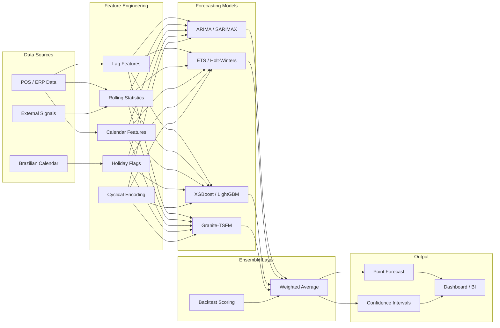

# Architecture

## Overview

**Watsonx Demand Forecasting BI** is a modular demand forecasting platform that combines
classical statistical methods, machine learning models, and IBM Watsonx Granite foundation
models into a unified ensemble pipeline. Designed for Brazilian retail operations, it
incorporates local calendar awareness (national holidays, Carnaval, commercial dates) and
multi-source feature engineering to deliver accurate, explainable forecasts with confidence
intervals.

---

## System Architecture

---

## Model Comparison

| Model | Type | Strengths | Weaknesses | Use Case |
|-------|------|-----------|------------|----------|
| **ARIMA / SARIMAX** | Statistical | Well-understood, interpretable, handles trend and seasonality | Assumes linearity, slow on large datasets | Stable demand patterns with clear seasonality |
| **ETS (Holt-Winters)** | Statistical | Adaptive smoothing, good for seasonal data | Limited to single seasonal period | Short-to-medium horizon with weekly cycles |
| **XGBoost / LightGBM** | Machine Learning | Handles non-linear relationships, feature-rich | Requires feature engineering, less interpretable | Complex demand with many external drivers |
| **Granite-TSFM** | Foundation Model | Zero-shot capability, captures complex patterns | API dependency, higher latency | Cold-start products, novel patterns |

---

## Feature Engineering Pipeline

### Lag Features

Autoregressive features capture temporal dependencies:
- `quantity_lag_1`: Previous day sales
- `quantity_lag_7`: Same day last week
- `quantity_lag_14`: Two weeks ago
- `quantity_lag_28`: Four weeks ago

### Rolling Statistics

Window-based aggregations smooth noise and capture trends:
- Rolling mean, std, min, max over 7, 14, and 30 day windows
- Per-SKU computation prevents data leakage across products

### Calendar Features

Temporal indicators derived from the date column:
- `day_of_week`, `day_of_month`, `month`, `quarter`, `week_of_year`
- `is_weekend`, `is_month_start`, `is_month_end`
- Cyclical sine/cosine encoding for periodic features

---

## Brazilian Calendar Integration

The `calendar_br` module provides holiday-aware features critical for Brazilian retail:

### National Holidays (Fixed)
- Confraternizacao Universal (Jan 1)
- Tiradentes (Apr 21)
- Dia do Trabalho (May 1)
- Independencia do Brasil (Sep 7)
- Nossa Senhora Aparecida (Oct 12)
- Finados (Nov 2)
- Proclamacao da Republica (Nov 15)
- Dia da Consciencia Negra (Nov 20)
- Natal (Dec 25)

### Moveable Holidays (Easter-relative)
- Carnaval (Monday and Tuesday, 47-48 days before Easter)
- Quarta-feira de Cinzas (46 days before Easter)
- Sexta-Feira Santa (2 days before Easter)
- Corpus Christi (60 days after Easter)

### Commercial Dates
- Dia das Maes (2nd Sunday of May)
- Dia dos Namorados (June 12)
- Dia dos Pais (2nd Sunday of August)
- Dia das Criancas (Oct 12)
- Black Friday BR (4th Friday of November)
- Temporada Natal (Dec 1-24)

### Holiday Features
- `is_holiday`: Binary flag for national/regional holidays
- `is_commercial_date`: Binary flag for commercial events
- `days_to_next_holiday`: Countdown to nearest upcoming event
- `days_from_last_holiday`: Days since most recent event
- `holiday_name`: Label of the event for interpretability

---

## Ensemble Strategy

The `EnsembleForecaster` combines individual model predictions using inverse-error weighting
derived from backtesting performance:

1. **Backtesting**: Each model is evaluated on rolling time-series cross-validation folds
2. **Weight Computation**: Weights are proportional to `1 / RMSE` (or MAE/MAPE), so lower-error models receive higher influence
3. **Combination Methods**:
   - `weighted_average` (default): Inverse-error weighted blend
   - `simple_average`: Equal-weight combination
   - `best`: Use only the single best-performing model

---

## Deployment

### Docker

The application is containerized via `Dockerfile` and orchestrated with `docker-compose.yml`.
Environment variables (Watsonx credentials, forecast parameters) are configured through
`.env` files and `config/settings.yaml`.

### Configuration

- **Environment Variables**: Watsonx API key, project ID, service URL
- **YAML Settings**: Model hyperparameters, feature engineering parameters, evaluation config
- **Pydantic Settings**: Type-safe configuration with validation via `pydantic_settings`

### API

The forecasting service exposes REST endpoints for:
- Submitting forecast requests with configurable horizon
- Retrieving individual and ensemble model predictions
- Querying holiday and commercial date calendars
